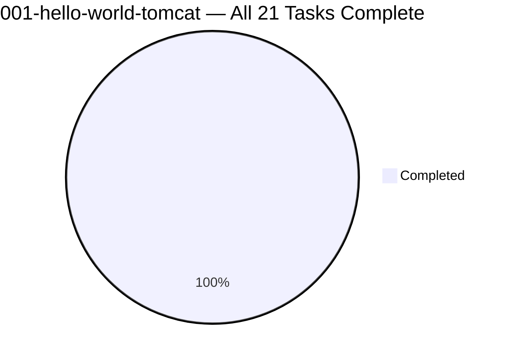
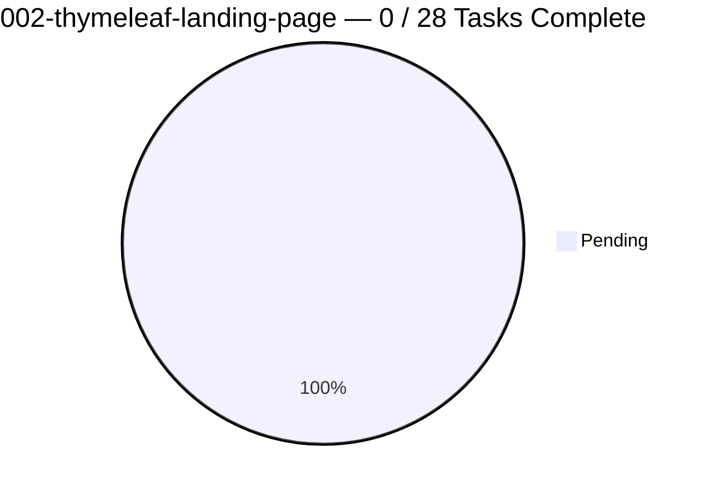
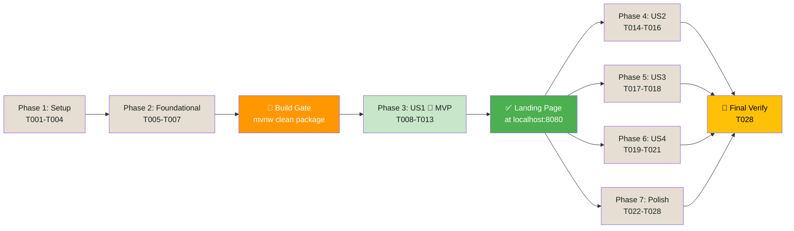

# Feature Progress Dashboard

**Generated**: 2026-05-31
**Branch**: `feat/002-thymeleaf-landing-page`

## SDD Lifecycle

```mermaid
gantt
    title ResumAIner — Feature Progress
    dateFormat X
    axisFormat %s

    section 001-hello-world-tomcat
    Specify :done, spec1, 0, 1
    Plan    :done, plan1, 1, 2
    Tasks   :done, tasks1, 2, 3
    Implement :done, impl1, 3, 4
    Verify  :done, veri1, 4, 5

    section 002-thymeleaf-landing-page
    Specify :done, spec2, 0, 1
    Plan    :done, plan2, 1, 2
    Tasks   :done, tasks2, 2, 3
    Implement :active, impl2, 3, 4
    Verify  :veri2, 4, 5
```

## Task Progress

## Summary

| Feature | SDD Phase | Tasks | Progress | Branch | Status |
|---|---|---|---|---|---|
| 001-hello-world-tomcat | ✅ Complete | 21/21 | 100% | `main` (merged) | ✅ Shipped |
| 002-thymeleaf-landing-page | 🔄 **Implement** | 0/28 | 0% | `feat/002-thymeleaf-landing-page` | 🎯 **Ready to start** |

## Phase Details: Feature 002

| SDD Phase | Status | Key Artifacts |
|---|---|---|
| 🔵 Specify | ✅ Complete | `spec.md` (Approved), `checklists/requirements.md`, `spec_input_files/` |
| 🟢 Plan | ✅ Complete | `plan.md` (7 sections), `component-diagram.md`, `quickstart.md` |
| 🟡 Tasks | ✅ Complete | `tasks.md` (28 tasks), `task-dag.md`, security review (LOW risk) |
| 🟠 Implement | 🔄 **Ready** | 14 waves, 5 phases, MVP at Wave 5 |
| 🔴 Verify | ⏳ Pending | After implementation |

## Execution Plan

## Commands

| Command | Purpose |
|---|---|
| `cd backend && .\mvnw.cmd clean package` | Build WAR |
| `docker compose -f docker/docker-compose.yml up` | Start full stack |
| `http://localhost:8080` | Landing Page (after US1) |

## Next Action

Ready to begin **Implementation Phase** — `/speckit.implement` Wave 0 (T001-T003).
