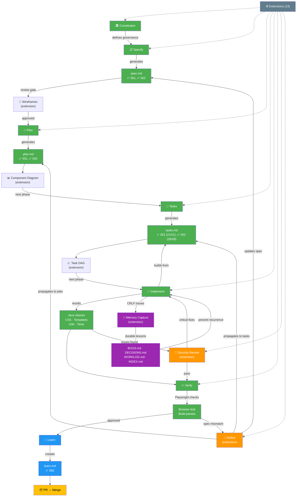
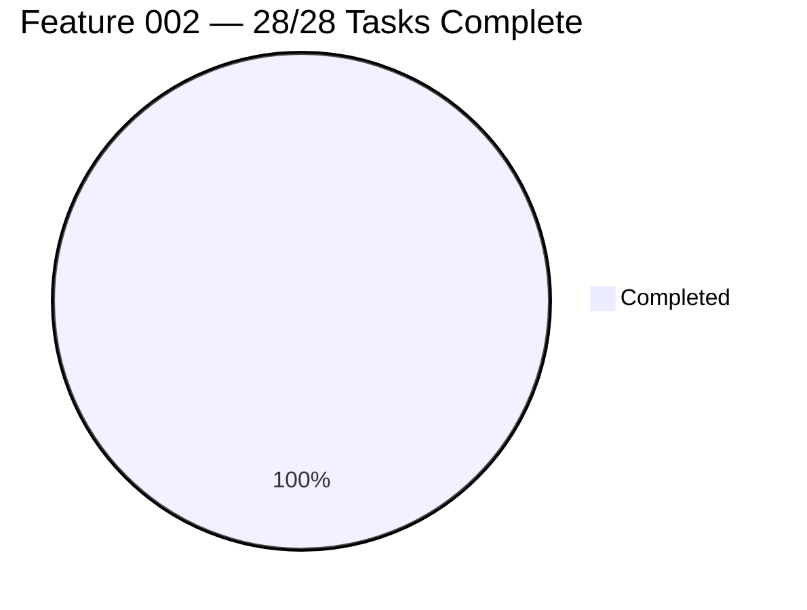

# SDD Workflow Diagram

**Generated**: 2026-05-31
**Project**: ResumAIner — Java + Vue web app

## Legend

| Color | Meaning |
|---|---|
| 🟢 Green | Phase completed (both features) |
| 🔵 Blue | Learning phase done |
| 🟡 Yellow | Ready — next action |
| 🟠 Orange | Feedback loop / review |
| 🟣 Purple | Durable memory capture |
| ⚪ Gray-blue | Extension infrastructure |

## Project State

| Metric | Value |
|---|---|
| **Features** | 2 (001 shipped ✅, 002 complete 🎯) |
| **Tasks total** | 49 (21 + 28) |
| **Tests** | 3 (MockMvc, all pass) |
| **Extensions** | 13 installed |
| **Durable memory** | 11 entries (A1, B1-B5, D1-D6, W1-W2) |
| **Current branch** | `feat/002-thymeleaf-landing-page` |
| **Next action** | Create PR → merge to `main` |

## Workflow Summary

